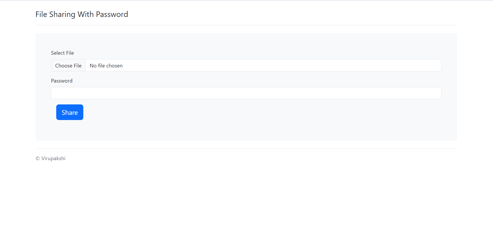
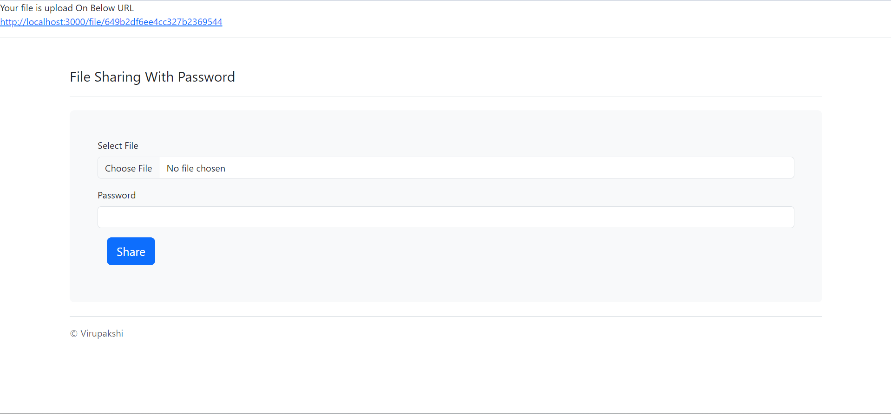
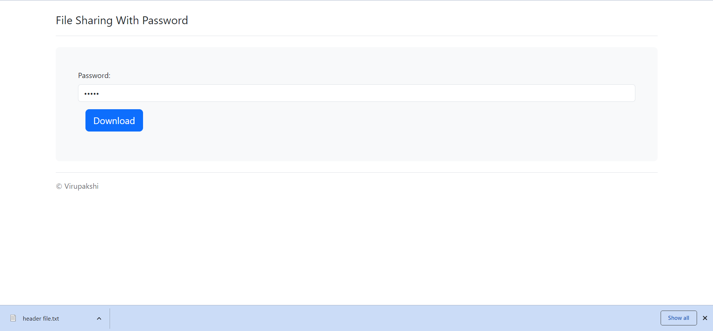

# Protected-File-Sharing App
<table>
<tr>
<td>
  Developed a secure file-sharing project implementing password-protected access. Utilized database integration for user authentication and access control. Enhanced data privacy and security while facilitating seamless and controlled file sharing.
</td>
</tr>
</table>


## Site

### Landing Page
Select file path and enter password and generate link




### Link Generating
Click link to download 


### Verifying and Downloading
If file has password verify and download



## How To Use

To clone and run this application, you'll need [Git](https://git-scm.com) and [Node.js](https://nodejs.org/en/download/) (which comes with [npm](http://npmjs.com)) installed on your computer. From your command line:

```bash
# Clone this repository
$ git clone https://github.com/virupakshi01/Protected-File-Sharing

# Go into the repository
$ cd Protected-File-Sharing

# Install dependencies
$ npm install

# Run the app
$ npm start
```


### Development
Want to contribute? Great!

To fix a bug or enhance an existing module, follow these steps:

- Fork the repo
- Create a new branch (`git checkout -b improve-feature`)
- Make the appropriate changes in the files
- Add changes to reflect the changes made
- Commit your changes (`git commit -am 'Improve feature'`)
- Push to the branch (`git push origin improve-feature`)
- Create a Pull Request 


## Built with 

- [Node.js](http://www.nodejs.com) - Javascript runtime Environment
- [Express Js](https://Expressjs.com) - Free , Rich Gallery , Customizable and Cross-browser compatible.
- [Bootstrap](http://getbootstrap.com/) - Extensive list of components and  Bundled Javascript plugins.


